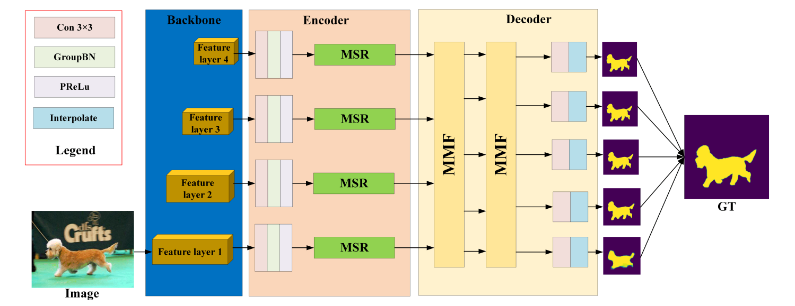

# MSRMNet: Multi-Scale Skip Residual and Multi-Mixed Features Network for Salient Object Detection
by Xinlong Liu, Luping Wang
## Introduction
The current models for the salient object detection (SOD) have made remarkable progress through multi-scale feature fusion strategies. However, the existing models have large deviations in the detection of different scales, and the target boundaries of the prediction images are still blurred. In this paper, we propose a new model address these issues using a transformer backbone to capture multiple feature layers. The model uses multi-scale skip residual connections during encoding to improve the accuracy of the model’s predicted object position and edge pixel information. Furthermore, to extract richer multi-scale semantic information, we perform multiple mixed feature operations in the decoding stage. In addition, we add the structure similarity index measure (SSIM) function with coefficients in the loss function to enhance the accurate prediction performance of the boundaries. Experiments demonstrate that our algorithm achieves state-of-the-art results on five public datasets, and enhances the performance metrics of the existing SOD tasks.


We provide the [saliency maps](https://pan.baidu.com/s/1Zt5zAEqTJRCamzwqYSV5FQ ) (Fetch Code: MSRM) for comparisons,  including DUTS-OMRON, DUTS-TE, ECSSD, HKU-IS, PASCAL-S.  The folder also contains the datasets used, the pretrained model, and our resulting model.

## Training
```
python3 train.py
```
- After training, the result models will be saved in `out` folder

## Acknowledgement
 The evaluation code comes from: https://github.com/zyjwuyan/SOD_Evaluation_Metrics.
Our work is based on [F3Net](https://github.com/weijun88/F3Net).
We fully thank their open-sourced code.
